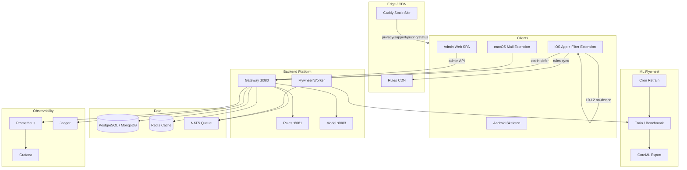

# MsgGuard Architecture Overview

**Last updated:** 2026-06-17

MsgGuard is a hybrid on-device + optional cloud AI spam filter for SMS (iOS primary), with macOS Mail extension and a Go backend for rules/models, feedback, and admin.

## Target Architecture

## Sub-documents

| Area | Document | Status |
|------|----------|--------|
| iOS client | [client-ios.md](architecture/client-ios.md) | Implemented |
| macOS Mail | [client-macos.md](architecture/client-macos.md) | In Progress |
| Android | [client-android.md](architecture/client-android.md) | Planned |
| Backend platform | [backend-platform.md](architecture/backend-platform.md) | Implemented |
| ML flywheel | [ml-flywheel.md](architecture/ml-flywheel.md) | Implemented |
| Auth & security | [auth-security.md](architecture/auth-security.md) | Implemented (prod secrets at deploy) |
| Commercial / tiers | [commercial.md](architecture/commercial.md) | Implemented (Apple creds at deploy) |
| Admin web | [admin-web.md](architecture/admin-web.md) | Implemented |

## Related

- [Threat model](../security/THREAT_MODEL.md)
- [Tier matrix](../deploy/TIER_MATRIX.md)
- [OpenAPI](../api/openapi.yaml)
- [Commercial readiness](../COMMERCIAL_READINESS.md)
