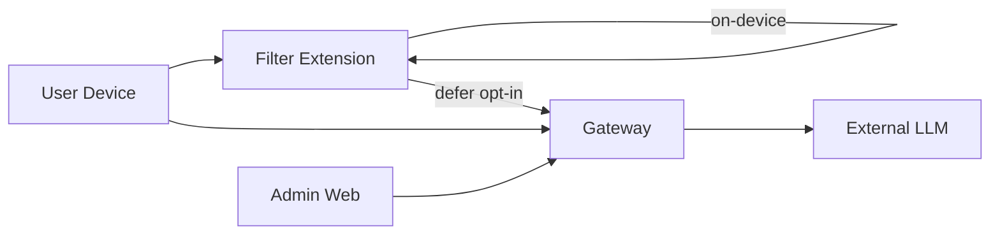

# MsgGuard Threat Model

**Last updated:** 2026-06-17  
**Scope:** iOS/macOS clients, gateway backend, admin web, static site, ML pipeline

## Assets

| Asset | Sensitivity | Location |
|-------|-------------|----------|
| SMS message body | High | Device (default); cloud only if Pro + opt-in |
| User feedback samples | Medium | Backend DB |
| Analytics events | Low–Medium | Backend DB (device_id, event names) |
| Admin API | High | Gateway |
| Model / rule bundles | Medium | CDN, App Group |
| Auth secrets | Critical | Env / K8s secrets |

## Trust Boundaries

## STRIDE Summary

| Threat | Mitigation | Status |
|--------|------------|--------|
| **Spoofing** admin API | Bearer + RBAC; mTLS in Tier 4 | Implemented |
| **Spoofing** device | Device token HMAC | Implemented |
| **Tampering** rules/models | Checksum + SHA256 OTA verify | Implemented |
| **Repudiation** | Audit log on feedback | Implemented |
| **Info disclosure** SMS | Default on-device; PII redact middleware | Implemented |
| **Info disclosure** analytics | DELETE privacy endpoint | Implemented |
| **DoS** gateway | Rate limit, load shed, HPA | Implemented |
| **Elevation** bootstrap token | Disabled in prod unless explicit env | Implemented |

## Client Threats

1. **Malicious rule bundle** — mitigated by signed checksum from trusted CDN; iOS verifies before apply.
2. **Extension memory scraping** — iOS sandbox; minimal retention in extension process.
3. **Jailbreak tampering** — out of scope for v1; server-side rate limits still apply.

## Backend Threats

1. **Open admin token endpoint** — `AUTH_BOOTSTRAP_ENABLED` gated off in production.
2. **LLM prompt injection via defer** — body length limits, circuit breaker, quota.
3. **Feedback poisoning** — ML engineer review queue; benchmark gates before deploy.

## Admin Web Threats

1. **XSS stealing Bearer token** — minimal DOM; token in sessionStorage; CSP recommended when hosted.
2. **CSRF on state-changing admin calls** — same-origin deployment; Bearer header (not cookie).

## Residual Risks

| Risk | Severity | Plan |
|------|----------|------|
| LLM provider data retention | Medium | Document in privacy policy; optional regional routing |
| No WAF on public API | Medium | Planned — Cloudflare / ingress WAF |
| Android attack surface | TBD | Threat model refresh when scaffold lands |

## Data Subject Requests

- `DELETE /api/v1/privacy/me?device_id=<uuid>` — erases analytics rows for device
- Email `privacy@msgguard.app` for account-level requests

## Review Cadence

Quarterly or before major release. Update this doc when adding new data flows or third parties.
